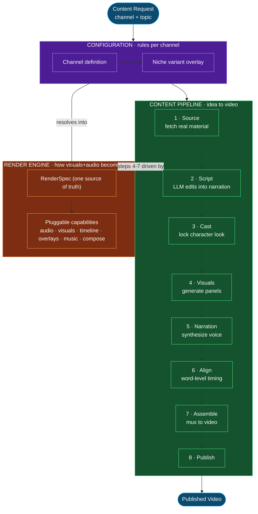
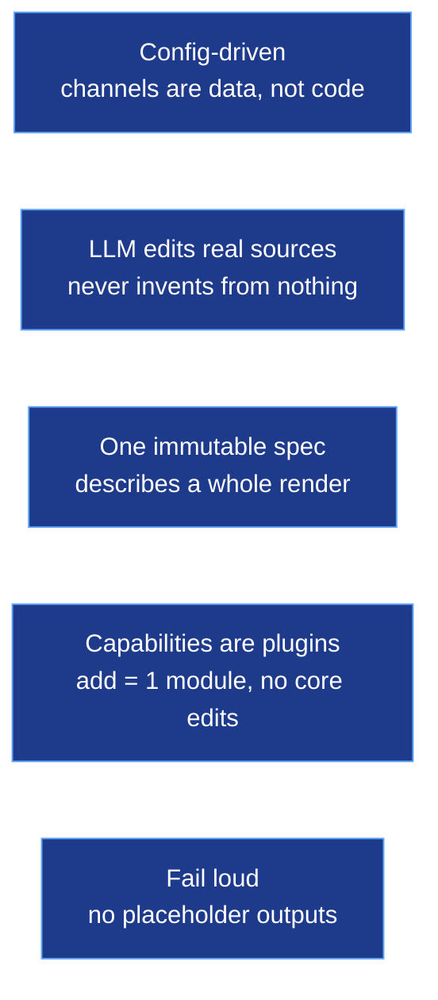
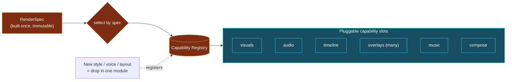

# ytFactory — High-Level Design (logical, deployment-agnostic)

The system as a set of responsibilities. Where anything runs (laptop,
cloud, GPU) is an implementation detail deliberately omitted here.

## 1 · System overview — layers

## 2 · Design principles (the alignment target)

## 3 · Render engine — the extensibility core

