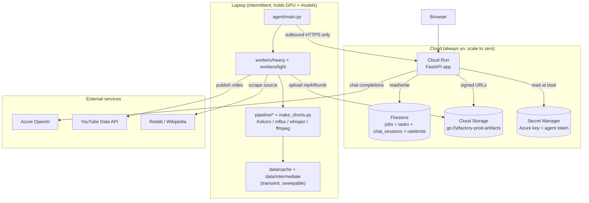
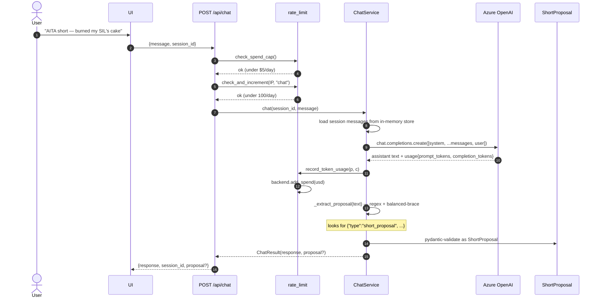
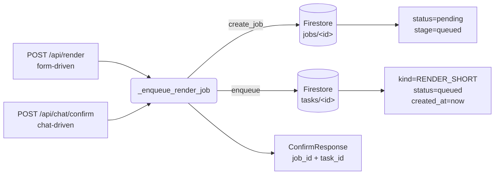
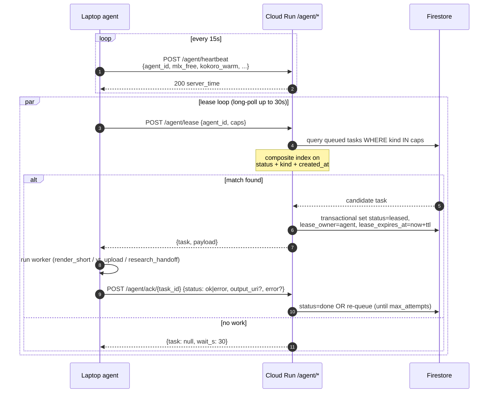
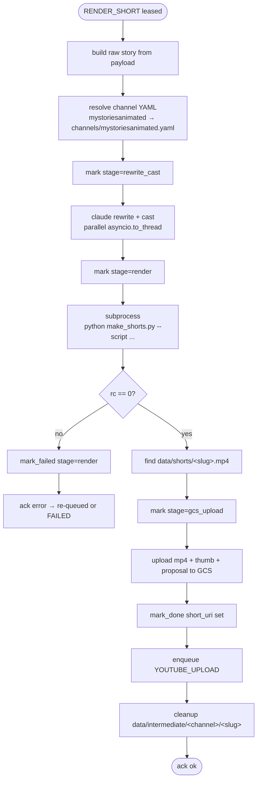
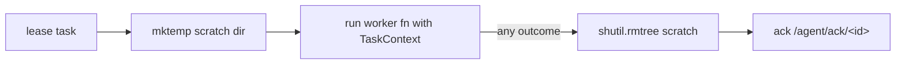
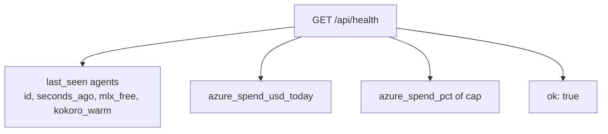

# Data Flows

System-level view of how data moves through ytFactory. Complements
`user_flows.md` (which is told from the user's perspective) and
`architecture.md` (which describes the components themselves).

If you're debugging "where did my data go?" or "why is this stuck?",
start here.

---

## 0. Where data lives



ASCII shorthand:

```
       Browser
          │
          ▼
    Cloud Run app  ◄──── Azure OpenAI (chat)
          │
          ├──► Firestore  (jobs / tasks / chat / ratelimits)
          ├──► Cloud Storage  (gs://.../jobs/<id>/...)
          └──► Secret Manager (read once at boot)
                    ▲
                    │ outbound HTTPS only
                    │
              Laptop agent
                    │
                    ├──► workers/heavy (render)
                    ├──► workers/light (yt upload, research handoff)
                    └──► data/cache + data/intermediate (transient)
                              │
                              └──► Reddit / Wikipedia / YouTube (external)
```

Two collections in Firestore are worth knowing:

| Collection | Doc id | What it holds |
|---|---|---|
| `tasks/<task_id>` | uuid | A single unit of work in the queue. Status: queued / leased / done / failed. |
| `jobs/<job_id>` | uuid | User-facing job state. Tracks all stages from chat-confirm to YT publish. |
| `chat_sessions/<session_id>` *(future)* | uuid | Multi-turn chat state. In-memory today; Firestore-backed when sessions need to outlive a Cloud Run cold start. |
| `ratelimits/<date>/...` | YYYY-MM-DD | Per-IP daily counters + global daily Azure spend. Resets at UTC midnight. |
| `youtube_videos/<video_id>` | YT video id | Post-publish handoff target — research pipeline reads from here. |

GCS layout under `gs://ytfactory-prod-artifacts/jobs/<job_id>/`:

```
proposal.json         # the ShortProposal that birthed the job (kept 30d)
short.mp4             # the finished Short (kept 7d → lifecycle delete)
thumb.png             # YouTube thumb (kept 30d)
beats/00..NN.png      # per-beat illustrations (kept 1d → lifecycle delete)
voice.wav             # narration (kept 1d)
captions.srt          # word-timestamps (kept 1d)
script.json           # rewritten narration (kept 1d)
cast.json             # character descriptions (kept 1d)
prompts.json          # per-beat scene prompts (kept 1d)
footage/cut_NN.mp4    # broadcast cut-ins (kept 1d, sports only)
```

After a successful YouTube upload, the worker explicitly **GCs** the
heavy artifacts (beats/, voice.wav, etc.) so they don't sit on the
1-day clock. Lifecycle rules are the safety net.

---

## 1. Chat extraction — text in, ShortProposal out



The system prompt is in `control/chat_service.py:SYSTEM_PROMPT`. It
asks the model to emit the JSON block once it has channel + topic.
The extractor is forgiving:

- accepts `{"type":"short_proposal"...}` and `{"type": "short_proposal" ...}` (whitespace tolerated)
- balanced-brace walk handles nested objects in `notes`
- failed `json.loads` returns `None` (the chat continues without an
  enqueueable proposal); the user sees the assistant text but no card

---

## 2. Job creation — proposal to queued task

Two entry points, identical downstream:



- **Both paths** call `chat_routes._enqueue_render_job(proposal)`.
- A `JobEnvelope` (Firestore: `jobs/<id>`) and a `TaskEnvelope`
  (Firestore: `tasks/<id>`) are created in the same call. They share
  the `job_id`; the task starts the chain.
- Status is `pending` until an agent leases the task; once leased,
  the worker advances it to `rendering`, `uploading`, `done`.

---

## 3. Lease protocol — pull-based, outbound-only

The laptop is behind NAT and can't accept inbound connections. The
agent connects out to Cloud Run, long-polls for tasks, and acks them
back over the same connection.



### Reliability guarantees

| Failure mode | Recovery |
|---|---|
| Agent crashes mid-task | Lease has TTL (default 5 min). Reaper requeues. |
| Lease ack lost in transit | Stale ack with `lease_owner != agent_id` is ignored. Task already requeued. |
| Worker raises exception | `runner.run` returns `(False, None, "<exception>")`; ack with `status=error`; task re-queued up to `max_attempts=3` times before FAILED. |
| Cloud Run cold start | Heartbeat gets exponential backoff up to 30s; lease loop continues. |
| Firestore composite index missing | Lease endpoint 500s; agent backoff retries. (Created at deploy time — see `gcloud firestore indexes composite list`.) |

---

## 4. Render — heavy worker on laptop

The big one. RENDER_SHORT mega-task wraps the existing
`make_shorts.py` pipeline so we didn't have to split each stage into
its own task.



`make_shorts.py` itself is a separate world — it loads Kokoro, mflux,
Whisper, runs ffmpeg, hits 8 internal stages. The render worker
treats it as a black box and just owns the file-level contract:

- **input**: data/intermediate/&lt;channel&gt;/scripts/&lt;slug&gt;.json
- **output**: data/shorts/&lt;slug&gt;.mp4 + (optional) thumb png

If you want to know what happens *inside* make_shorts.py, see
`docs/legacy_pipeline.md`.

### Per-task scratch + cleanup

Every leased task gets a fresh temp dir at `$YTFACTORY_SCRATCH_ROOT/task-<id8>-...`.
The runner deletes it unconditionally on ack — success, failure, or
worker exception. So even if a render crashes the laptop process, the
scratch dir doesn't leak.



---

## 5. Post-render — YouTube upload + GC + research handoff

```mermaid
sequenceDiagram
    autonumber
    participant AG as Agent
    participant FS as Firestore
    participant GCS
    participant YT
    participant R as pipeline.research

    Note over AG: leases YOUTUBE_UPLOAD
    AG->>GCS: download short.mp4 to scratch
    AG->>YT: insert(video, channel=...)
    YT-->>AG: video_id
    AG->>FS: jobs/&lt;id&gt;.youtube_url = https://youtu.be/...
    AG->>GCS: gc_heavy_artifacts(job_id)<br/>delete beats/, voice.wav, captions, scripts/cast/prompts
    AG->>FS: enqueue RESEARCH_HANDOFF

    Note over AG: leases RESEARCH_HANDOFF
    AG->>FS: youtube_videos/&lt;video_id&gt; = handoff metadata
    AG->>R: pipeline.research.rebuild(quiet=True)
    AG->>R: pipeline.youtube_stats.fetch_all([video_id])
    Note over AG: research-side helpers wrapped in try/except —<br/>YT is already published, never fail this step
```

### Why GC before research?

The published video is the persistent artifact. The intermediates
(beats, voice, captions) were only needed to *produce* it. Once it's
on YouTube:

- **Storage cost** trends to zero — only `proposal.json` + `thumb.png`
  + `short.mp4` (briefly) remain.
- **Research pipeline** works from the YouTube Data API + a small
  metadata doc. Doesn't need the rendering artifacts.
- **Privacy** — chat-extracted notes only live as long as the render
  is in progress.

GCS lifecycle rules are the **backstop**:

| Pattern | Auto-delete after |
|---|---|
| `jobs/*/short.mp4` | 7 days |
| `jobs/*/{thumb.png, proposal.json}` | 30 days |
| `jobs/*/{voice.wav, captions.srt, prompts.json, script.json, cast.json}` | 1 day |
| `jobs/**/*.png` (catches beats/) | 1 day |

---

## 6. Job status polling — the UI's view

After enqueue, the UI polls `GET /api/jobs/{id}` every ~3s until the
job reaches a terminal state (`done`, `failed`, `cancelled`).

```mermaid
sequenceDiagram
    participant UI
    participant CR as GET /api/jobs/{id}
    participant FS as Firestore jobs/&lt;id&gt;
    participant GCS
    loop every 3s
        UI->>CR: GET /api/jobs/{id}
        CR->>FS: get(job_id)
        alt status=done
            CR->>GCS: signed_url(short_uri, ttl=10min)
            GCS-->>CR: short-lived HTTPS URL
        end
        CR-->>UI: JobView{status, stage, short_signed_url, youtube_url, error}
        alt terminal status
            UI->>UI: stop polling
            UI->>User: download mp4 + watch on YT
        end
    end
```

The signed URL is regenerated on every poll (cheap) and TTLs to 10
minutes — long enough to download in the browser, short enough that
sharing the URL is safe.

---

## 7. Rate-limit + spend-cap circuit

A safety perimeter on the public endpoint that prevents bots and
runaway chats from draining the Azure budget.

```mermaid
flowchart TB
    Req[/POST /api/chat or /api/render/]
    Req --> A{owner_ip?}
    A -- yes --> Skip[skip per-IP counter]
    A -- no --> B{spent &gt;= $5/day cap?}
    B -- yes --> S503[503 Service Unavailable<br/>"resumes after UTC midnight"]
    B -- no --> C{IP used quota?}
    C -- yes --> S429[429 Too Many Requests]
    C -- no --> D[counter +1]
    D --> Allow[forward to handler]
    Skip --> Allow
    Allow --> Handler[chat or render]
```

The counters live in `ratelimits/<UTC-date>/...` so they reset every
day automatically — no cron needed.

---

## 8. What surfaces in `/api/health`

For ops visibility into "is anything broken right now":



Sample response:

```json
{
  "ok": true,
  "agents": [
    {"agent_id": "Rohits-MacBook-Pro", "seconds_ago": 4,
     "mlx_free_pct": 78.0, "kokoro_warm": true, "mflux_warm": false,
     "on_battery": false}
  ],
  "azure_spend_usd_today": 0.0096,
  "azure_spend_cap_usd": 5.0,
  "azure_spend_pct": 0.19
}
```

If `agents` is empty → no laptop is connected; queued jobs sit waiting.
If `seconds_ago > 60` for the agent you expect → it's not heartbeating.
If `azure_spend_pct > 90` → chat is about to start returning 503s.

---

## Cross-references

- `docs/architecture.md` — components, deployment, IAM, repo layout
- `docs/user_flows.md` — three user types and their journeys
- `docs/legacy_pipeline.md` — what `make_shorts.py` does internally
- `README.md` — top-level overview and runtime instructions
