# ytFactory — Low-Level Design (LOCKED)

**Source of truth for the rebuild.** The design leads; code conforms. Every element
below exists and imports in `pipeline/core/` (verified 2026-07-12). Do not change a
contract shape without updating this doc.

## Diagrams
Rendered PNGs (sources in [diagrams/](diagrams/)). Re-render high-res with
`mmdc -i F.mmd -o F.png -t dark -b '#0d1117' -s 4 -p puppeteer-config.json`
(`-s 4` = 4× device scale → ~3136 px wide, crisp for deck/video). Two orientation
diagrams first, then one per pipeline component:

| | |
|---|---|
| 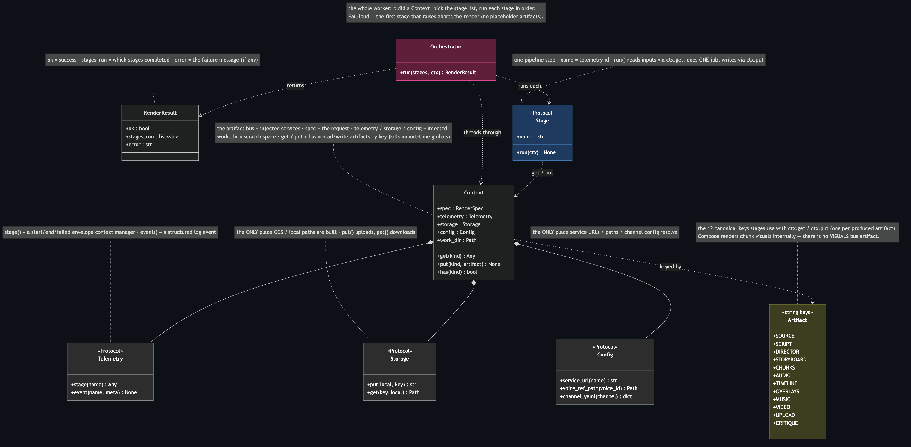 | 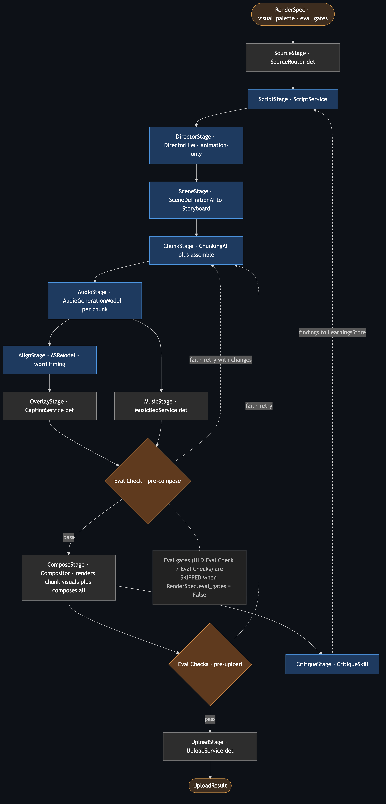 |
| **Spine** — Orchestrator / Stage / Context / 12 artifact keys | **12-stage overview** + learnings loop |
| 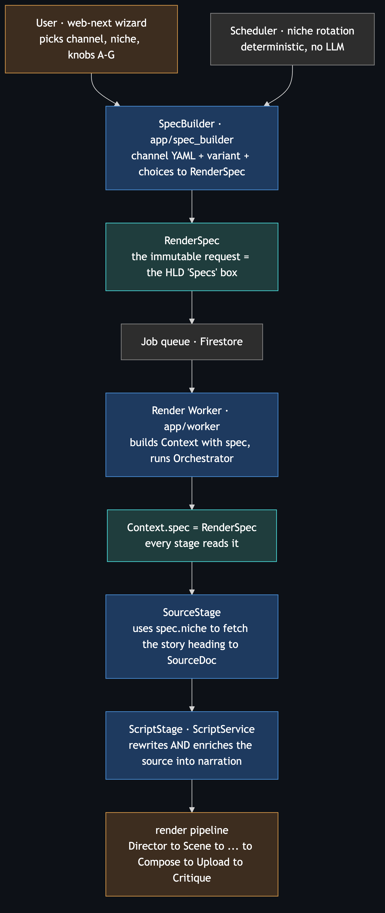 | 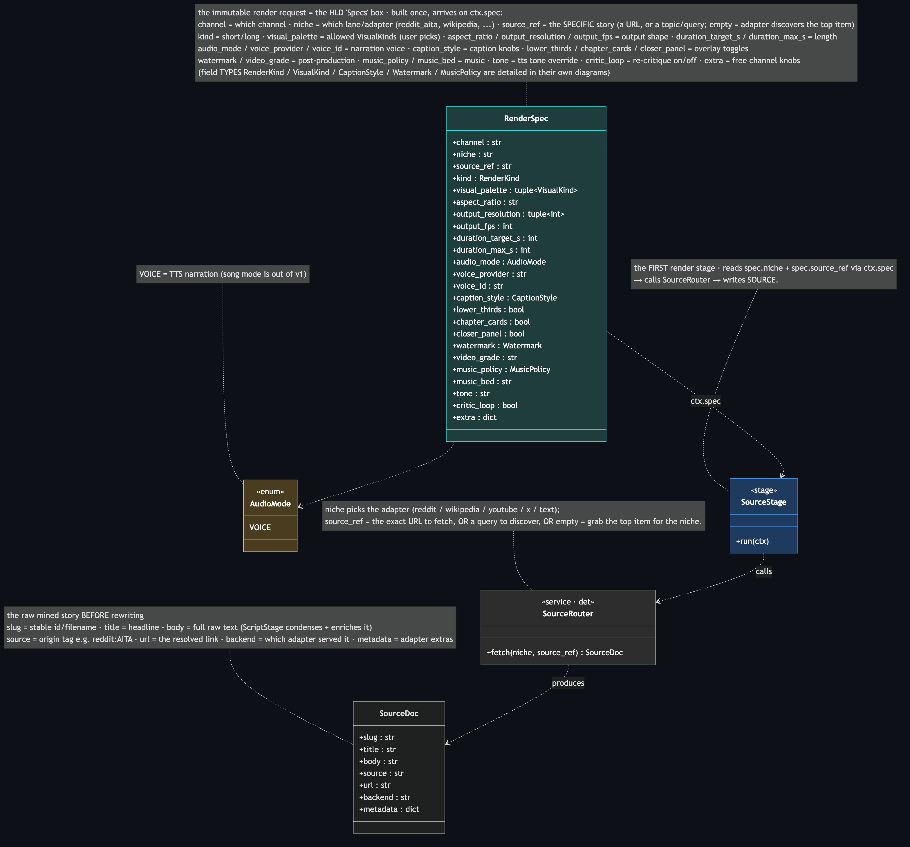 |
| **Entry / control plane** — wizard + scheduler → job | **Source** — full `RenderSpec` + `SourceRouter` → `SourceDoc` |
| 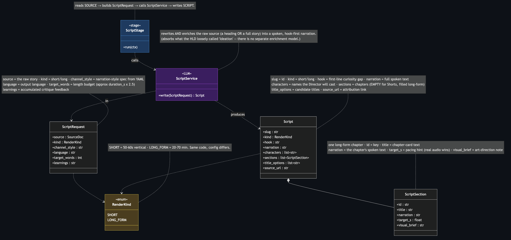 | 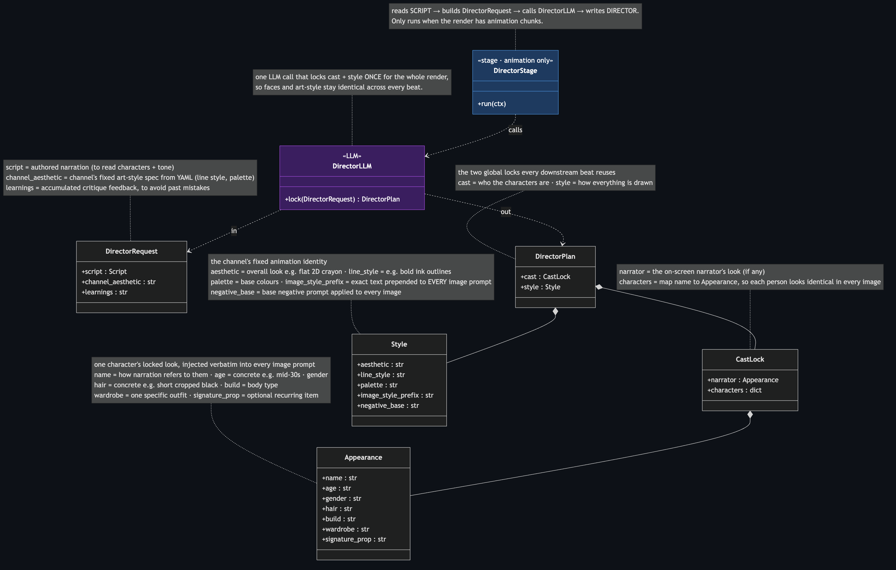 |
| **Script** — `ScriptService` → `Script(sections)` | **Director** — `DirectorLLM` → `CastLock` + `Style` (animation) |
| 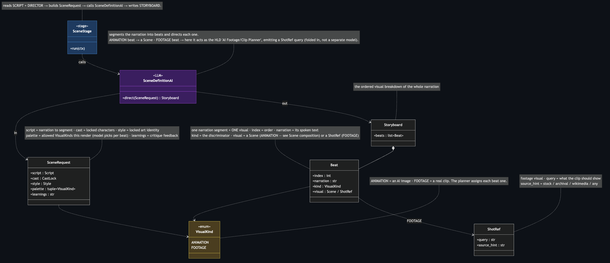 | 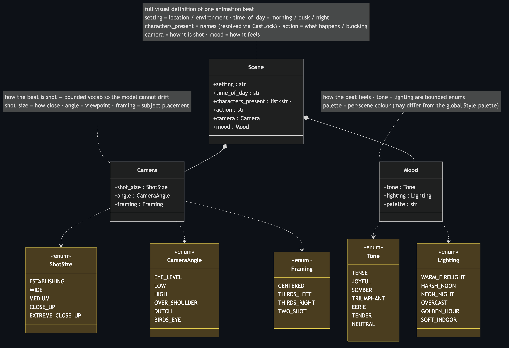 |
| **Scene planning** — `SceneDefinitionAI` → `Storyboard` | **Scene composition** — `Beat(Scene\|ShotRef)` detail |
| 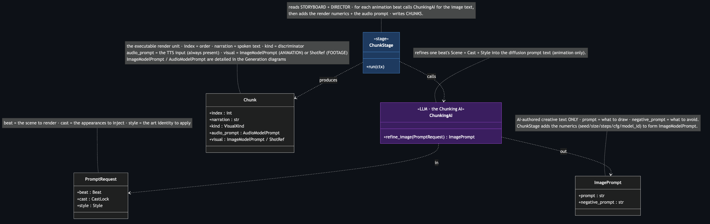 | 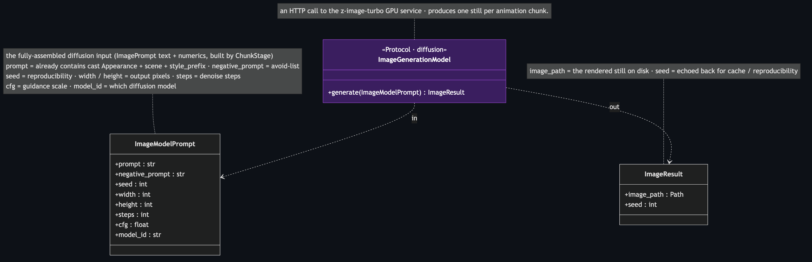 |
| **Chunk** — `ChunkingAI` → `Chunk(audio + one visual)` | **Image gen** — `ImageGenerationModel` → `ImageResult` |
| 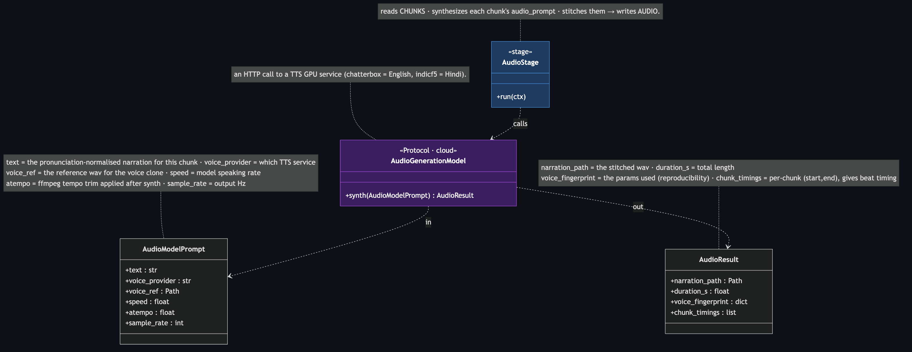 | 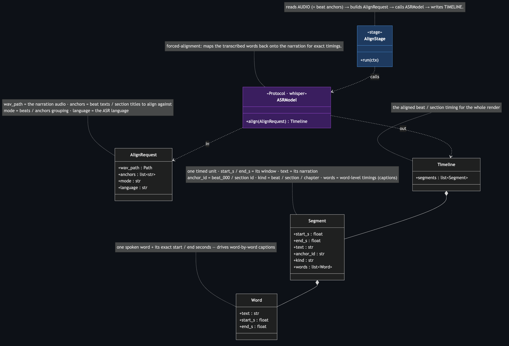 |
| **Audio gen** — `AudioGenerationModel` → `AudioResult` | **ASR / Timeline** — `ASRModel` → `Timeline` |
| 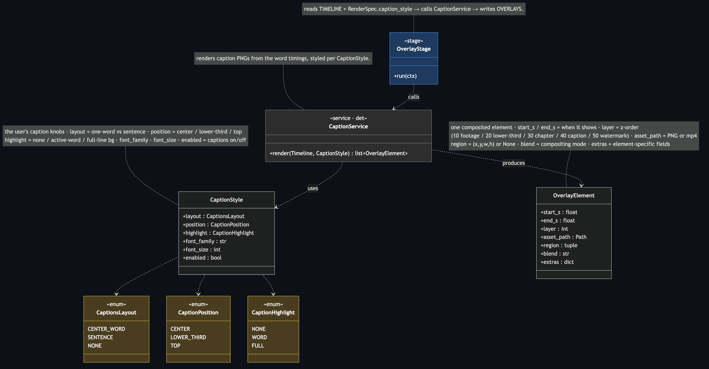 | 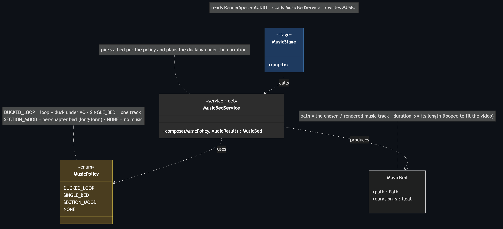 |
| **Captions / overlay** — `CaptionService` → `OverlayElement[]` | **Music** — `MusicBedService` → `MusicBed` |
| 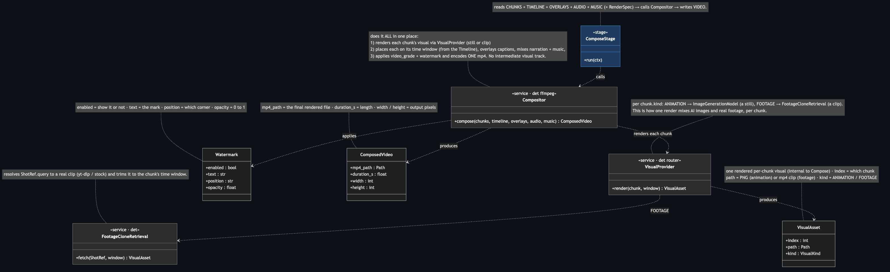 | 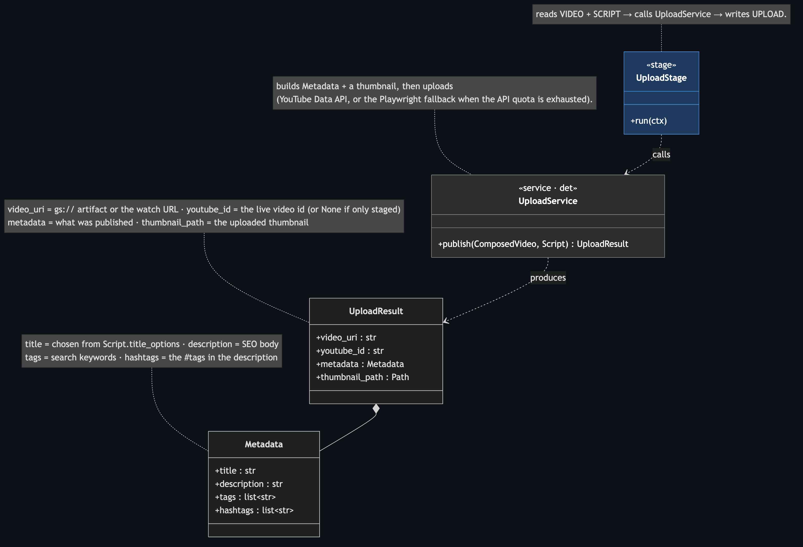 |
| **Compose** — `Compositor` renders chunk visuals + composes all → mp4 | **Upload** — `UploadService` → `UploadResult` |
| 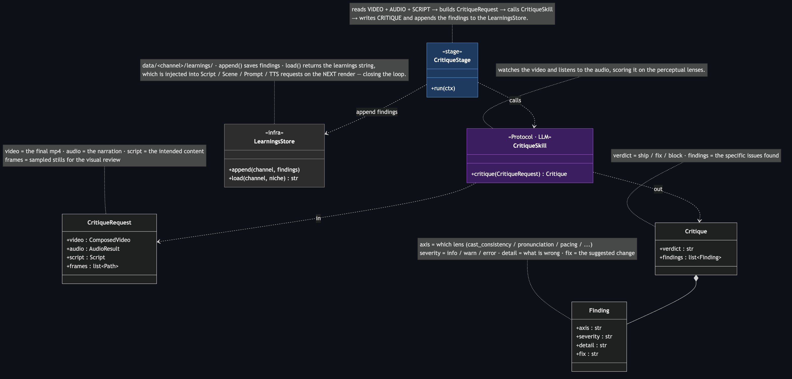 | |
| **Critique + learnings** — `CritiqueSkill` → `Critique` → `LearningsStore` | |

## Conventions
- **Contract** = a typed data record (`@dataclass`), fields only, no behavior.
- **Model** = an AI interface with exactly one method `verb(InputContract) → OutputContract`.
- **Service** = a deterministic interface (same shape, no AI).
- **Stage** = orchestration only: `run(ctx)` reads named artifacts, calls **one**
  collaborator, writes **one** artifact. Stages never call each other.

## Spine (`pipeline/core/`)
- `Stage` (Protocol): `name: str`, `run(ctx: Context)`.
- `Context`: `spec: RenderSpec` + injected `telemetry / storage / config` + `get(kind)` / `put(kind, artifact)`.
- `Orchestrator.run(stages, ctx) → RenderResult` — the whole worker.

## Contracts (data)
- **Input**: `RenderSpec` (+ `CaptionStyle`, and enums `RenderKind / VisualKind /
  AudioMode(VOICE) / MusicPolicy / CaptionsLayout`). `visual_palette: tuple[VisualKind,…]`
  = the kinds this render may use (channel offers, user picks).
- **Ingestion**: `SourceDoc`.
- **Authoring**: `Script` (narration + `sections: list[ScriptSection]` — empty Shorts,
  populated long-form — + metadata; **no beats**).
- **Director**: `DirectorPlan{cast: CastLock, style: Style}`; `CastLock{narrator, characters}`;
  `Appearance`; `Style`.
- **Scene (per-chunk visual)**: `Storyboard{beats: list[Beat]}`;
  `Beat{index, narration, kind: VisualKind, visual: Scene | ShotRef}`;
  `Scene{setting, time_of_day, characters_present, action, camera, mood}`;
  `ShotRef{query, source_hint}`;
  `Camera{shot_size, angle, framing}`; `Mood{tone, lighting, palette}`.
- **Chunk (executable unit)**: `Chunk{index, narration, kind: VisualKind, audio_prompt,
  visual: ImageModelPrompt | ShotRef}` — one audio + one visual per chunk;
  `ImageModelPrompt{prompt, negative_prompt, seed, width, height, steps, cfg, model_id}`;
  `AudioModelPrompt{text, voice_provider, voice_ref, speed, atempo, sample_rate}`.
- **Media**: `AudioResult`, `Timeline{segments: list[Segment]}`,
  `Segment{start_s, end_s, text, anchor_id, kind, words}`, `Word`, `OverlayElement`, `MusicBed`.
  `VisualAsset` / `VisualAssets` are **Compositor-internal** (the raw per-chunk visuals it renders,
  then composes) — not a bus artifact.
- **Publish/feedback**: `ComposedVideo`, `Metadata`, `UploadResult`, `Critique{verdict, findings}`, `Finding`.
- **Styling**: `Style{aesthetic, line_style, palette, image_style_prefix, negative_base}` — sole home of
  `image_style_prefix`; `Watermark`. `video_grade` + `watermark` live on `RenderSpec` (no `ChannelStyle`).

## AI models (8 — `pipeline/core/models.py`)
Uniform shape: one typed Request → one Output.
| Model | method |
|---|---|
| `ScriptService` | `write(ScriptRequest) → Script` |
| `DirectorLLM` | `lock(DirectorRequest) → DirectorPlan` (Cast + Style lock; animation only) |
| `SceneDefinitionAI` | `direct(SceneRequest) → Storyboard` (segments + per-beat kind + Scene\|ShotRef) |
| `ChunkingAI` | `refine_image(PromptRequest) → ImagePrompt` (the "Chunking AI"; numerics added by ChunkStage) |
| `ImageGenerationModel` | `generate(ImageModelPrompt) → ImageResult` |
| `AudioGenerationModel` | `synth(AudioModelPrompt) → AudioResult` |
| `ASRModel` | `align(AlignRequest) → Timeline` |
| `CritiqueSkill` | `critique(CritiqueRequest) → Critique` |

`FootagePlanModel` was folded into `SceneDefinitionAI` (footage intent = `ShotRef` on the beat).
No Ideation model — topics come from the wizard or the scheduler rotation; `ScriptService` enriches.

## Stage catalog (12 — each row is one class)
One spine, no AI-vs-footage branch: `ComposeStage` renders each chunk's visual via a `VisualProvider`
that dispatches to `ImageGenerationModel` (animation) or `FootageCloneRetrieval` (footage), then composes
everything in one pass. `DirectorStage` + `SceneStage` produce animation direction; footage beats carry a
`ShotRef` directly.
| # | Stage | reads | collaborator | writes |
|---|---|---|---|---|
| 1 | `SourceStage` | `RenderSpec` | `SourceRouter` ·det | `SOURCE` |
| 2 | `ScriptStage` | `SOURCE` | `ScriptService` | `SCRIPT` |
| 3 | `DirectorStage` | `SCRIPT` | `DirectorLLM` | `DIRECTOR` (animation only) |
| 4 | `SceneStage` | `SCRIPT`, `DIRECTOR` | `SceneDefinitionAI` | `STORYBOARD` (per-beat kind + Scene\|ShotRef) |
| 5 | `ChunkStage` | `STORYBOARD`, `DIRECTOR` | `ChunkingAI` + assemble | `CHUNKS` (audio_prompt + one visual) |
| 6 | `AudioStage` | `CHUNKS` | `AudioGenerationModel` | `AUDIO` |
| 7 | `AlignStage` | `AUDIO`, anchors | `ASRModel` | `TIMELINE` |
| 8 | `OverlayStage` | `TIMELINE`, `RenderSpec` | `CaptionService` ·det | `OVERLAYS` |
| 9 | `MusicStage` | `RenderSpec`, `AUDIO` | `MusicBedService` ·det | `MUSIC` |
| 10 | `ComposeStage` | `CHUNKS`, `TIMELINE`, `OVERLAYS`, `AUDIO`, `MUSIC` | `Compositor` ·det (renders chunk visuals + composes all) | `VIDEO` |
| 11 | `UploadStage` | `VIDEO`, `SCRIPT` | `UploadService` ·det | `UPLOAD` |
| 12 | `CritiqueStage` | `VIDEO`, `AUDIO`, `SCRIPT` | `CritiqueSkill` | `CRITIQUE` |

Feedback: `Critique` findings → `LearningsStore` (`data/<channel>/learnings/`) →
`Config.learnings()` injected into `ScriptService` / `SceneDefinitionAI` / `ChunkingAI` / `AudioGenerationModel` next run.

Full file map + responsibility rules + clean-code rules: [structure.md](structure.md).
