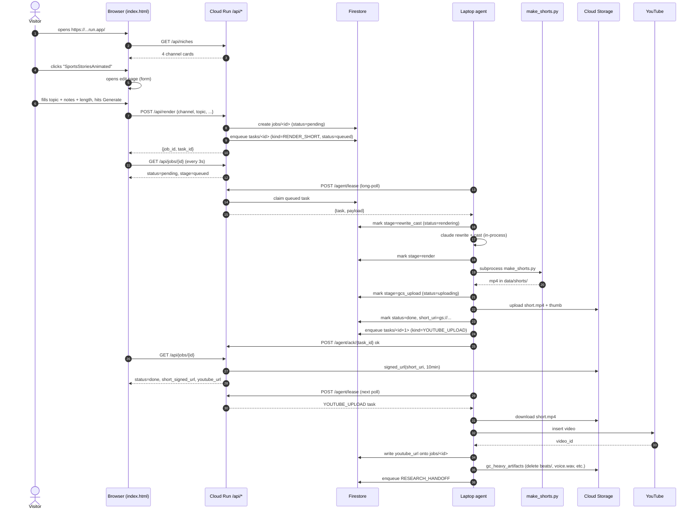
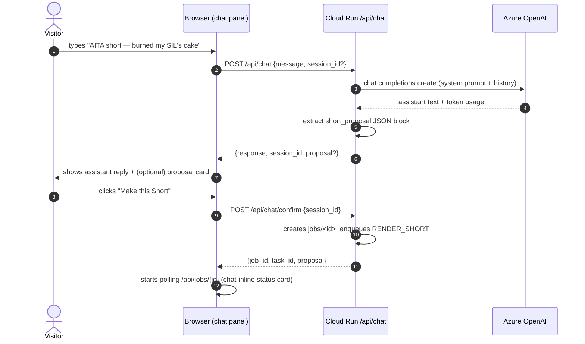
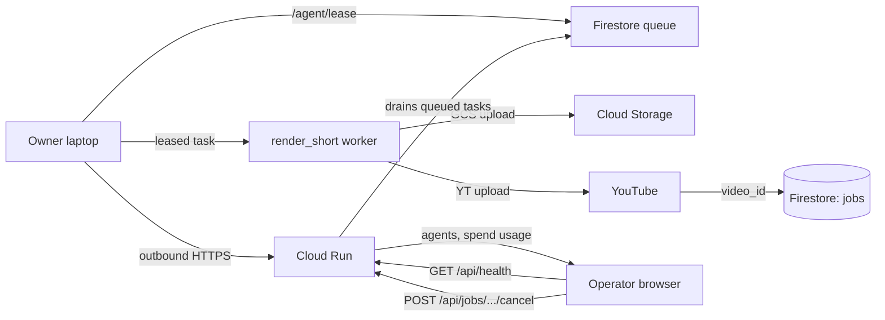
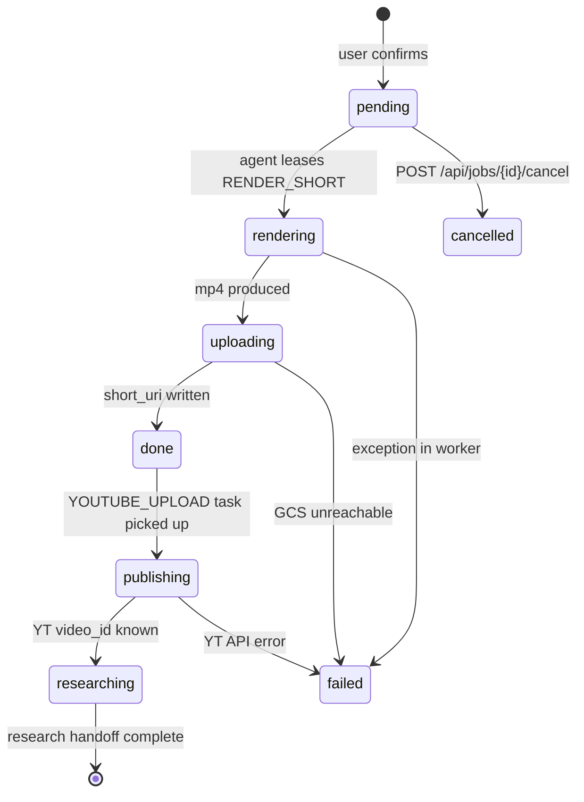

# User Flows

Three user types interact with ytFactory. Each has a distinct journey
through the product. Diagrams below render in any Markdown viewer that
understands Mermaid (GitHub, VS Code with the Mermaid extension, GitLab).
ASCII fallbacks for raw-text views are included.

---

## 1. Visitor — fills the form per niche (primary path)

The default flow. A first-time visitor sees the niche reel, picks a
channel, fills a small form, and gets a finished mp4.



ASCII summary:

```
visitor ─► reel ─► card click ─► edit form ─► Generate
                                                  │
                                                  ▼
                          /api/render ─► Firestore (job+task)
                                                  │
                                          ┌───────┴────────┐
                                          ▼                ▼
                              UI polls /api/jobs    laptop leases task
                                          │                │
                                          │     rewrite → cast → make_short
                                          │     → upload to GCS → ack DONE
                                          │                │
                                          └─────► UI sees status=done
                                                           │
                                                           ▼
                                                  YOUTUBE_UPLOAD leases
                                                           │
                                                  publishes to YT,
                                                  GCs intermediates,
                                                  hands off to research
```

### Key UX guarantees

- **<200 ms first paint** — niche reel is static JSON, no LLM call.
- **Form survives refresh** — `localStorage` could be added later; today the
  status panel persists if the user navigates back to the same job id.
- **Failures surface in the same panel** — if any stage fails, the
  status card shows the stage + error string; no silent hangs.
- **Cancellation** — `POST /api/jobs/{id}/cancel` flips the job to
  `cancelled` and drops queued tasks.

---

## 2. Visitor — free-form chat (alternative path)

For visitors who don't want a form. The chat panel on the right is
always available; clicking the **Open prompt** card opens it with a
welcome message.



After the confirm, this path joins the same render → upload → research
chain as the form flow.

### Why two paths?

Different user mindsets:
- **Form** — "I know what I want, just take my topic and length."
  Faster path to a finished Short. Form fields are forgiving (notes,
  length slider, source-kind dropdown).
- **Chat** — "I'm exploring. I want the AI to ask questions and shape
  this with me." Better for ambiguous topics, multi-turn refinement,
  and people who type fast.

The chat extracts the same `ShortProposal` schema the form uses, so
the downstream chain is identical.

---

## 3. Owner — auto-publish + monitor

The site operator (you) wants more than the visitor experience: render
caps that don't lock you out of your own URL, monitoring, cancel.



### Owner-specific flows

| Action | How |
|---|---|
| **Bypass per-IP rate limit** | Set `YTFACTORY_OWNER_IPS=<your-ip>` env on Cloud Run. Spend cap still applies. |
| **Monitor agent presence + spend** | `GET /api/health` → agents (last seen / mlx_free / kokoro_warm) + Azure spend USD today vs cap. |
| **Cancel a stuck job** | `POST /api/jobs/{id}/cancel`. Flips job status → `cancelled`, marks queued tasks FAILED so no agent leases them. Already-running tasks finish on the laptop. |
| **Publish to a YouTube channel** | The `pipeline/upload.py` module uses the OAuth tokens stored under `data/intermediate/<channel>/youtube_oauth.json`. The render worker passes `channel` as the upload target. |
| **Operate locally** | `./scripts/serve_cloud.sh` — same FastAPI app, runs on `:8765` with hot-reload on `control/`, `web/`, `shared/`. Useful when iterating on control-plane code before redeploying. |

---

## State machine — where any job lives at any moment



The `failed` and `cancelled` terminal states surface to the UI through
the same `/api/jobs/{id}` endpoint with `status` + `error` set; the
status card stops polling and shows a retry hint.

---

## Anti-abuse perimeter

Every public-facing endpoint has tiered limits. Defaults are tuned so a
single curious visitor can chat freely but bots can't burn the daily
Azure budget.

| Limit | Default | Where |
|---|---|---|
| Anonymous chat msgs / IP / day | 100 | `control/rate_limit.py` |
| Anonymous renders / IP / day | 20 | `control/rate_limit.py` |
| Per-session chat turns | 50 | `control/chat_service.py` |
| Global Azure spend / day | $5 USD | `YTFACTORY_AZURE_DAILY_CAP_USD` env, returns 503 |
| Owner IP bypass | none | `YTFACTORY_OWNER_IPS` env, comma-separated |

When a limit fires the UI surfaces a friendly message; the daily reset
is at UTC midnight (the Firestore counter doc is keyed by date).
